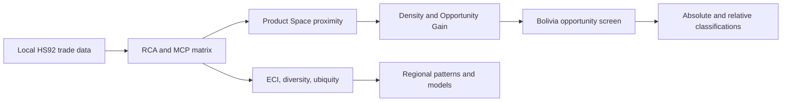

# Economic Complexity and Structural Transformation in Latin America

**Productive capabilities, divergent development paths and diversification opportunities for Bolivia**

Repository: <https://github.com/MonicaCT/economic-complexity-structural-transformation-lac>


## Research question

How do economic complexity, export diversification and Product Space proximity characterize divergent structural transformation patterns in Latin America, and what do they imply for Bolivia's feasible diversification opportunities?

## Why this project matters

Latin America's development challenge is not only to grow, but to build broader productive capabilities. Bolivia illustrates the policy tension clearly: many high-transformation products are distant from the current export basket, while nearby products may offer limited upgrading. This repository turns local trade and macro data into a reproducible complexity workflow, validates the main indicators and translates product-level metrics into cautious screening tools for further sector research.

## Key findings

- The processed panel covers 6,497,429 country-product-year observations, 242 countries, 1,243 HS92 four-digit products and 1995-2023.
- Bolivia 2023 records ECI = -1.236, diversity = 82, HHI = 0.124 and primary export share = 62.7 percent.
- Bolivia's HHI is slightly above the regional median reported in validation outputs; concentration is interpreted comparatively, not in isolation.
- The 2023 Product Space has 701,978 analytical positive edges and a 698-edge visual subset; density uses the analytical matrix.
- The relative opportunity screen identifies 11 strategic bets, 239 incremental extensions, 107 transformational long shots, 454 middle-range candidates, 41 low-priority products and 286 excluded candidates.
- Fixed-effects models are observational associations with country and year fixed effects; they are not causal estimates.

## Bolivia at a glance

| Indicator | Value | Interpretation |
|---|---:|---|
| ECI 2023 | -1.236 | Relative annual complexity position. |
| Diversity | 82 | HS4 products with RCA >= 1. |
| HHI | 0.124 | Slightly above the reported regional median of 0.118. |
| Primary export share | 62.7% | Resource and primary-product orientation remains important. |
| Strategic bets | 11 | Relative screening candidates, not automatic recommendations. |
| Incremental extensions | 239 | Nearer products that may support learning and export continuity. |

## Main figures


## Methodology



The analysis uses established economic-complexity methods. ECI is standardized within each year, so longitudinal movement is interpreted as relative annual position. Product rankings are analytical screening tools rather than investment prescriptions.

## Interactive dashboard


The Shiny dashboard runs locally and includes regional ECI trajectories, a Bolivia Opportunity Lab, Product Space diagnostics, econometric model tables and validation notes.

```powershell
Rscript scripts/run_dashboard.R
```

## Paper and outputs

- [Working paper HTML](paper/main.html)
- [Working paper PDF](paper/main.pdf)
- [Policy brief](paper/policy_brief.html)
- [Revised Bolivia opportunities workbook](outputs/tables/xlsx/bolivia_opportunities_revised.xlsx)
- [Final repository check](outputs/reports/FINAL_REPOSITORY_CHECK.md)

If PDF artifacts are absent after cloning, regenerate them with `Rscript scripts/render_paper.R`.

## Repository structure

```text
R/                  Main R pipeline and demo script
scripts/            Validation, rendering and final-check scripts
data/sample/        Small public sample data
docs/               Audits, methodology and GitHub preparation notes
docs/assets/        Repository banner and dashboard preview
outputs/            Final figures, reports and small tables
paper/              Working paper, appendix, policy brief and references
dashboard/          Local Shiny dashboard
config/             Example configuration files
tests/              Lightweight validation tests
```

## Reproducibility

- Demo: `Rscript R/98_run_demo.R` uses only public samples.
- Processed-output validation: run Phase 2/3 scripts without scanning raw folders.
- Full rebuild: copy `config/paths.example.yml` to ignored `config/paths.local.yml`, edit local paths and run `Rscript R/99_run_all.R`.

## Data availability

The original local source folders contain roughly 168.3 GB and are not included in GitHub. Large processed caches are also ignored. Public samples and validation outputs are included so the repository can be inspected without private local data.

## Limitations

The project uses export data, so it does not observe non-exported capabilities, services, informal production, environmental constraints, firm-level readiness or political economy. Opportunity scores guide screening; they do not select investments. Econometric models are descriptive associations, not causal estimates.

## Citation

Cueto Tapia, M. (2026). *Economic Complexity and Structural Transformation in Latin America: Productive Capabilities, Divergent Development Paths, and Diversification Opportunities for Bolivia* (Version 1.0.0) [Research software and reproducible analysis]. GitHub. <https://github.com/MonicaCT/economic-complexity-structural-transformation-lac>

Use `CITATION.cff` for machine-readable citation metadata. No DOI is listed because no DOI has been created.

## Author

Monica Cueto Tapia  
Applied Economist | Development Analytics | Economic Complexity | Public Policy | Data Science
