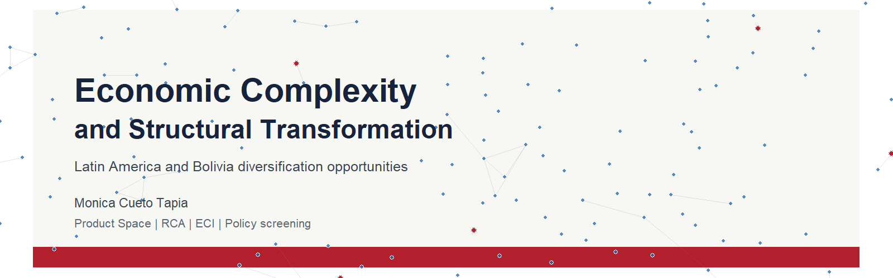
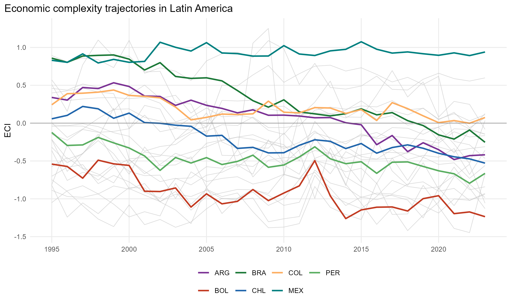
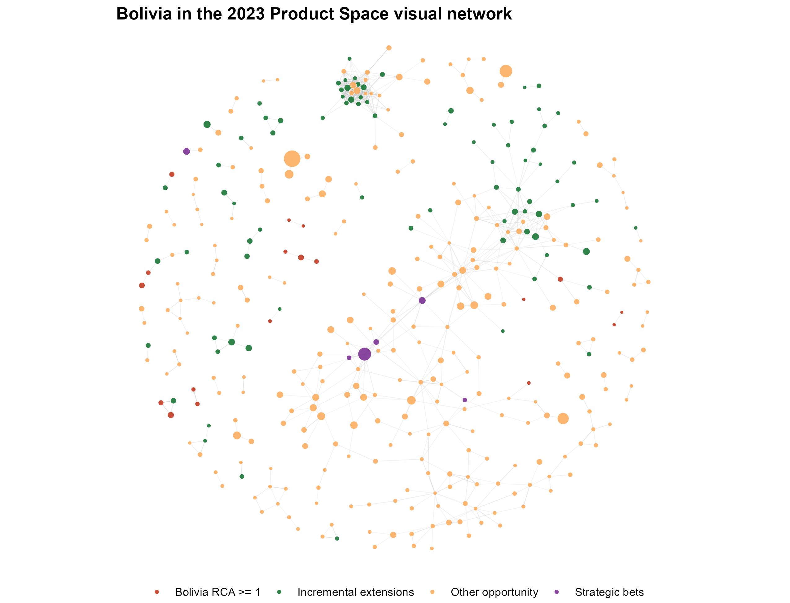
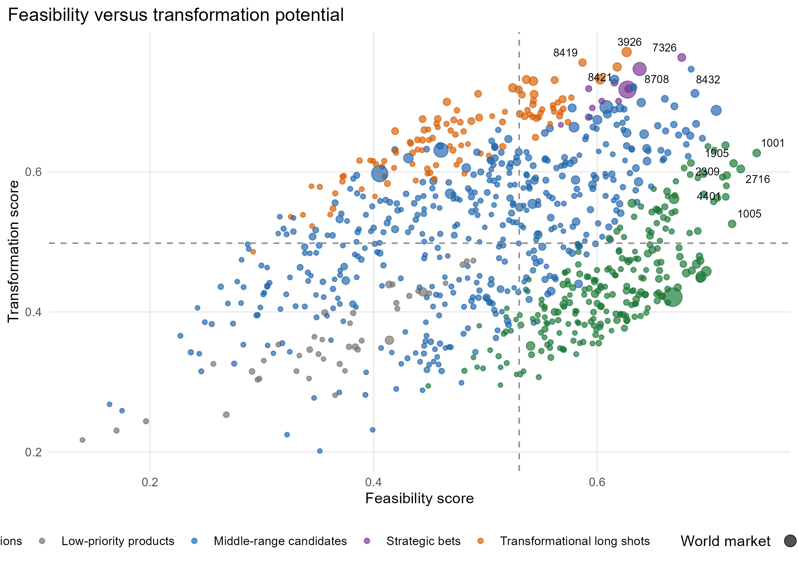
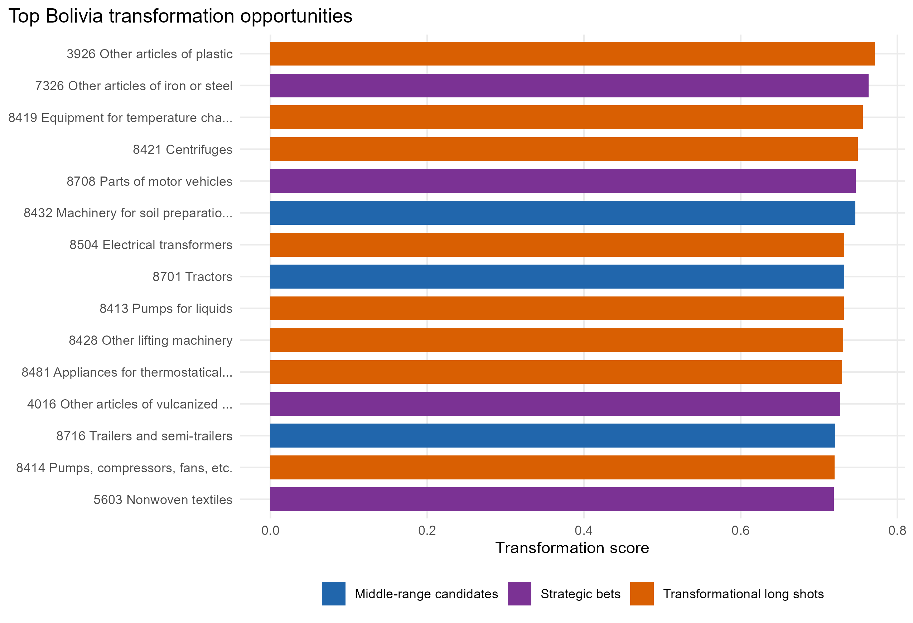
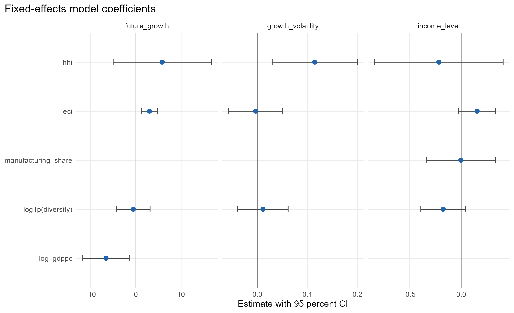
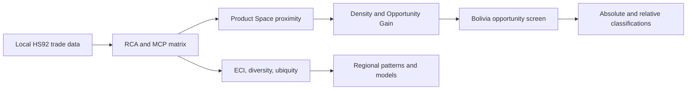
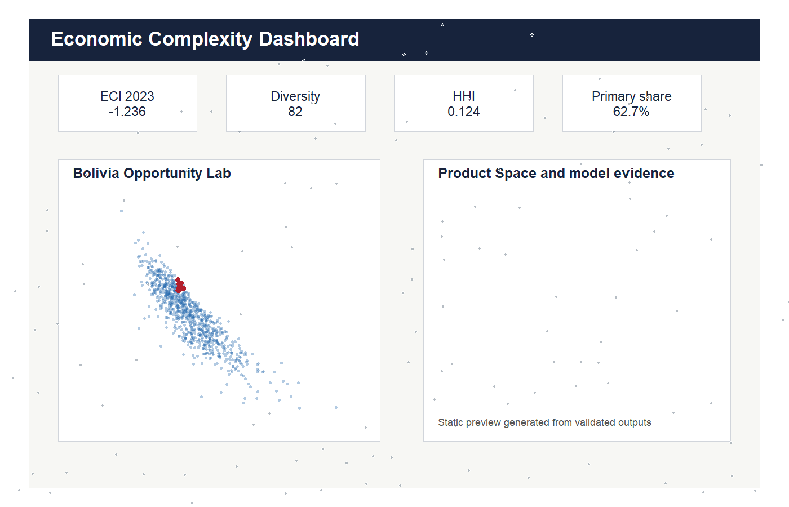

# Economic Complexity and Structural Transformation in Latin America

[](https://doi.org/10.5281/zenodo.21314881)
[](https://github.com/MonicaCT/economic-complexity-structural-transformation-lac/releases/tag/v1.0.1)

**Productive capabilities, divergent development paths and diversification opportunities for Bolivia**

Repository: <https://github.com/MonicaCT/economic-complexity-structural-transformation-lac>



[](dashboard/)
[](paper/main.html)
[](paper/policy_brief.html)
[](docs/METHODOLOGY.md)
[](#reproducibility)
[](https://doi.org/10.5281/zenodo.21314881)

[](https://github.com/MonicaCT/economic-complexity-structural-transformation-lac)
[](paper/main.pdf)
[](https://github.com/MonicaCT/economic-complexity-structural-transformation-lac/releases/tag/v1.0.1)

## Research question

How do economic complexity, export diversification and Product Space proximity characterize divergent structural transformation patterns in Latin America, and what do they imply for Bolivia's feasible diversification opportunities?

The repository links economic complexity, diversification, structural transformation and economic performance through a reproducible Latin American panel, with a detailed Bolivia application that separates nearby incremental extensions from more distant high-transformation opportunities.

## Why this matters

Latin America's development challenge is not only to grow, but to build broader productive capabilities. Bolivia illustrates the policy tension clearly: many high-transformation products are distant from the current export basket, while nearby products may offer limited upgrading. This repository turns local trade and macro data into a reproducible complexity workflow, validates the main indicators and translates product-level metrics into cautious screening tools for further sector research.

## Key findings

- The processed panel covers 6,497,429 country-product-year observations, 242 countries, 1,243 HS92 four-digit products and 1995-2023.
- Bolivia 2023 records ECI = -1.236, diversity = 82, HHI = 0.124 and primary export share = 62.7 percent.
- Bolivia's HHI is slightly above the regional median reported in validation outputs; concentration is interpreted comparatively, not in isolation.
- The 2023 Product Space has 701,978 analytical positive edges and a 698-edge visual subset; density uses the analytical matrix.
- The relative opportunity screen identifies 11 strategic bets, 239 incremental extensions, 107 transformational long shots, 454 middle-range candidates, 41 low-priority products and 286 excluded candidates.
- Fixed-effects models are observational associations with country and year fixed effects; they are not causal estimates.

## Bolivia at a glance

| Indicator | Value | Interpretation |
|---|---:|---|
| ECI 2023 | -1.236 | Relative annual complexity position. |
| Diversity | 82 | HS4 products with RCA >= 1. |
| HHI | 0.124 | Slightly above the reported regional median of 0.118. |
| Primary export share | 62.7% | Resource and primary-product orientation remains important. |
| Strategic bets | 11 | Relative screening candidates, not automatic investment recommendations. |
| Incremental extensions | 239 | Nearer products that may support learning and export continuity. |

## Portfolio classification

| Dimension | Classification |
|---|---|
| Primary Lab | Applied Economics Lab |
| Secondary Labs | Research Methods Lab; Data Science Lab; Open Science Lab |
| Research domain | Economic complexity, structural transformation, diversification and development economics |
| Research question | How do productive capabilities and Product Space proximity shape feasible diversification paths in Latin America and Bolivia? |
| Methods | RCA, ECI, PCI, Product Space proximity, density, Opportunity Gain, network analysis and panel econometrics |
| Tools | R, Shiny, Quarto, GitHub Actions, validation scripts and reproducible research workflows |
| Scientific status | Published repository; working paper; reproducible research project; Zenodo archived release |
| Portfolio role | Demonstrates advanced economic-complexity analysis, Product Space methods, network analysis, panel econometrics, reproducible research and policy-oriented interpretation for Latin America and Bolivia. |

## Main figures











## Data

The validated analytical panel covers:

- 6,497,429 country-product-year observations;
- 242 countries;
- 1,243 HS92 four-digit products;
- 1995-2023.

The original local source folders contain roughly 168.3 GB and are not included in GitHub. Large processed caches are also ignored. Public samples and validation outputs are included so the repository can be inspected without private local data.

## Methodology



The analysis uses established economic-complexity methods. ECI is standardized within each year, so longitudinal movement is interpreted as relative annual position. Product rankings are analytical screening tools rather than investment prescriptions.

Detailed documentation: [methodology](docs/METHODOLOGY.md), [empirical strategy](docs/EMPIRICAL_STRATEGY.md), [Product Space validation](docs/PRODUCT_SPACE_VALIDATION.md), [limitations](docs/LIMITATIONS.md) and [reproducibility guide](docs/REPRODUCIBILITY.md).

## Paper and reports

- [Working paper HTML](paper/main.html)
- [Working paper PDF](paper/main.pdf)
- [Policy brief](paper/policy_brief.html)
- [Final repository check](outputs/reports/FINAL_REPOSITORY_CHECK.md)
- [Validation report](outputs/reports/VALIDATION_REPORT.html)
- [Test results](outputs/reports/TEST_RESULTS.md)

If PDF artifacts are absent after cloning, regenerate them with `Rscript scripts/render_paper.R`.

## Dashboard



The Shiny dashboard is a local dashboard application, not a public live site. It includes regional ECI trajectories, a Bolivia Opportunity Lab, Product Space diagnostics, econometric model tables and validation notes.

```powershell
Rscript scripts/run_dashboard.R
```

Dashboard source: [dashboard/app.R](dashboard/app.R).

## Repository structure

```text
R/                  Main R pipeline and demo script
scripts/            Validation, rendering and final-check scripts
data/sample/        Small public sample data
docs/               Audits, methodology and GitHub preparation notes
docs/assets/        Repository banner and dashboard preview
outputs/            Final figures, reports and small tables
paper/              Working paper, appendix, policy brief and references
dashboard/          Local Shiny dashboard
config/             Example configuration files
tests/              Lightweight validation tests
```

## Reproducibility

- Demo: `Rscript R/98_run_demo.R` uses only public samples.
- Processed-data workflow: validation and final-check scripts inspect committed processed outputs without scanning private raw folders.
- Full reconstruction: copy `config/paths.example.yml` to ignored `config/paths.local.yml`, edit local paths and run `Rscript R/99_run_all.R`.

See [REPRODUCIBILITY.md](docs/REPRODUCIBILITY.md) for the full distinction between demo execution, processed-output checks and full reconstruction.

## Limitations

The project uses export data, so it does not observe non-exported capabilities, services, informal production, environmental constraints, firm-level readiness or political economy. Opportunity scores guide screening; they do not select investments. Econometric models are descriptive associations, not causal estimates. Product-level classifications depend on HS92 data quality, RCA thresholds and the distance/proximity structure used in the Product Space.

## Citation

DOI: <https://doi.org/10.5281/zenodo.21314881>

Cueto Tapia, M. (2026). *Economic Complexity and Structural Transformation in Latin America: Productive Capabilities, Divergent Development Paths, and Diversification Opportunities for Bolivia* (Version 1.0.1) [Research software and reproducible analysis]. GitHub. <https://github.com/MonicaCT/economic-complexity-structural-transformation-lac>

Use [CITATION.cff](CITATION.cff) for machine-readable citation metadata, including the Zenodo DOI.

## Author

[Monica Cueto Tapia](https://github.com/MonicaCT)

Applied Economist | Research Scientist | Development Analytics | Public Policy | Business Intelligence | Data Science | Open Science

## Portfolio navigation

[Back to Monica Cueto Tapia's research portfolio](https://github.com/MonicaCT)

**Primary Lab:** Applied Economics Lab

**Secondary Labs:** Research Methods Lab, Data Science Lab, Open Science Lab

**Related projects:**

- [poverty-informality-social-protection-lac](https://github.com/MonicaCT/poverty-informality-social-protection-lac)
- [latin-america-financial-development-lab](https://github.com/MonicaCT/latin-america-financial-development-lab)
- [structural-vulnerability-lac-research](https://github.com/MonicaCT/structural-vulnerability-lac-research)
