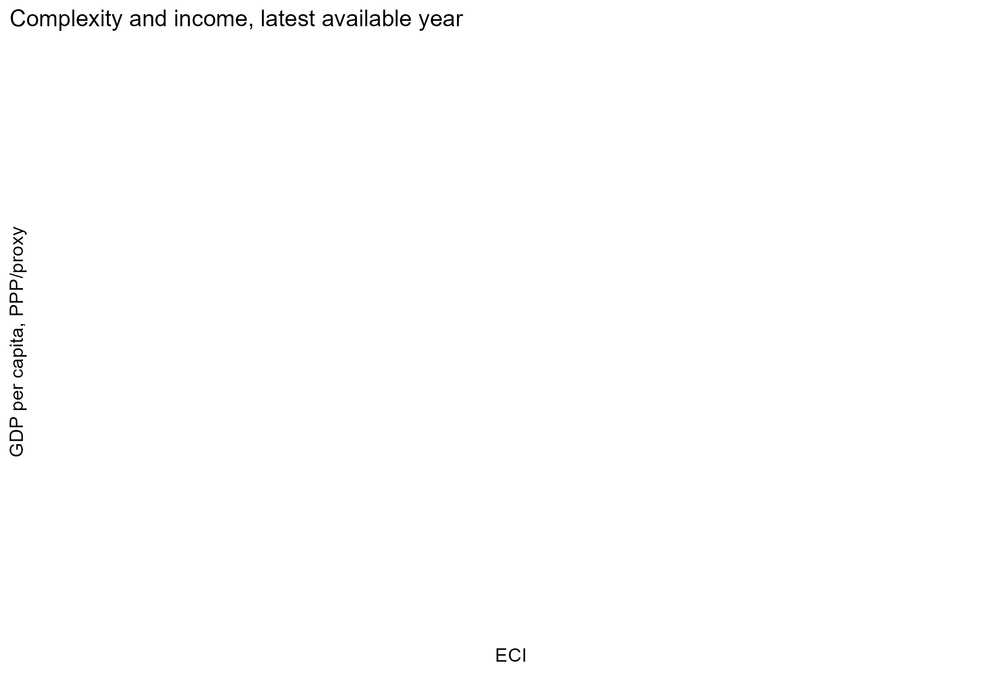
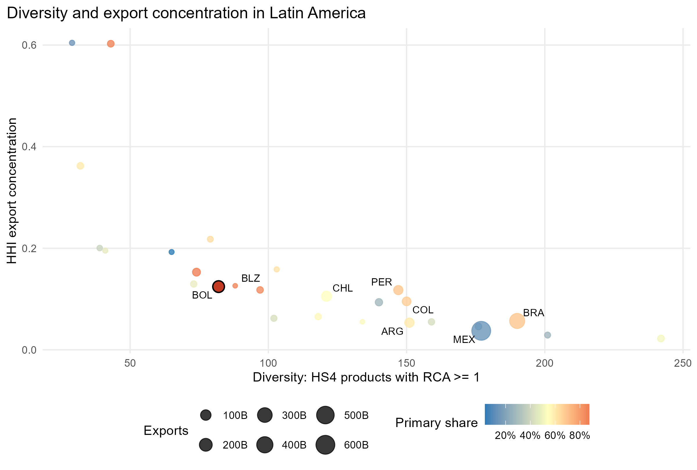
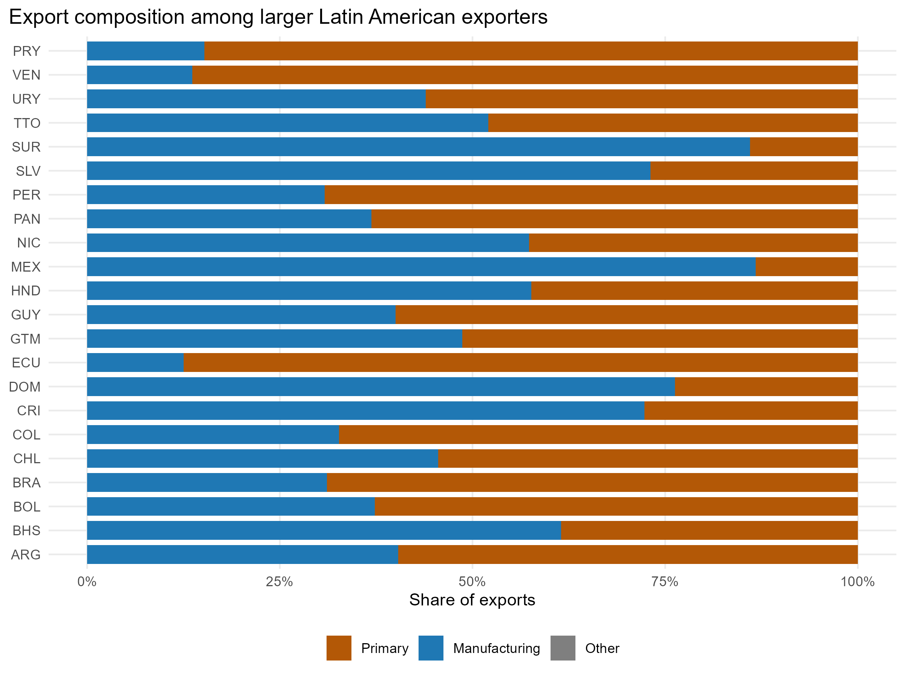
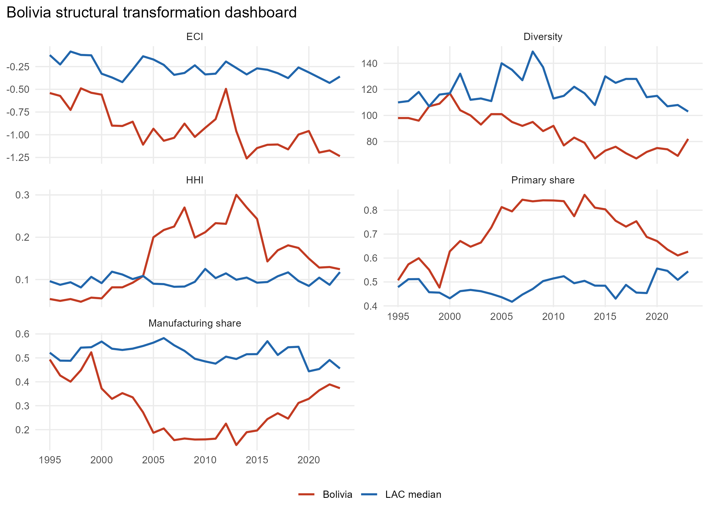
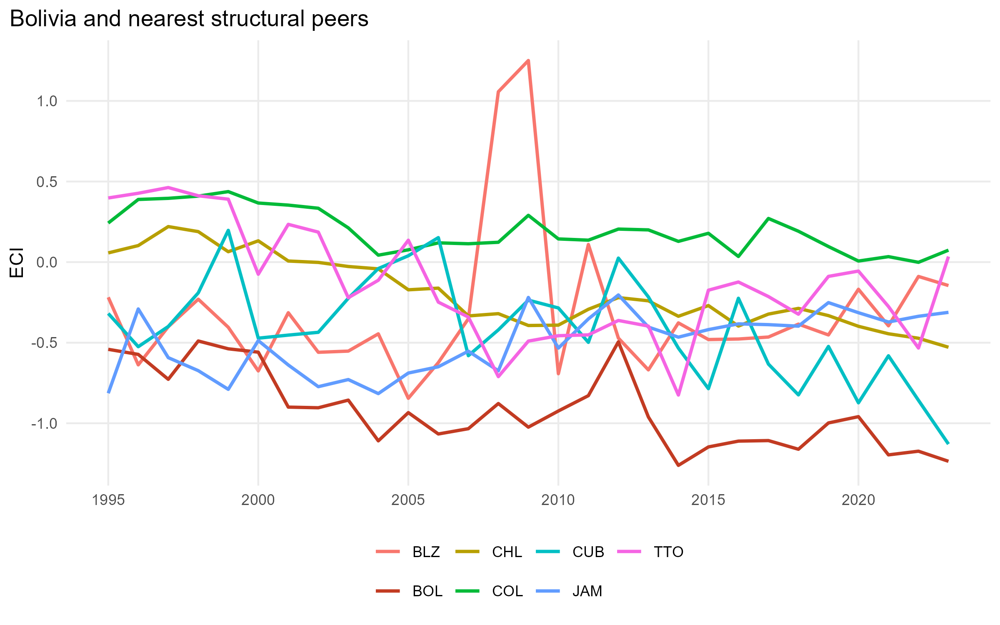
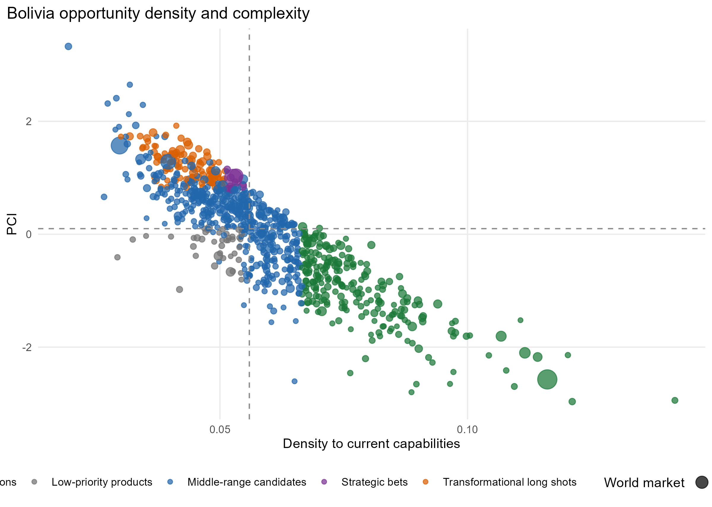

# Abstract

Latin America's long-run development challenge is not only to grow, but to transform productive structures that often remain concentrated in primary and resource-linked exports. This paper studies economic complexity, export diversification and structural transformation in Latin America, with Bolivia as a focused country case. It uses a locally reconstructed Harvard Atlas HS92 four-digit country-product-year panel covering 6,497,429 observations, 242 countries, 1,243 products and 1995-2023, combined with processed country-year macro controls. The empirical strategy computes revealed comparative advantage, diversity, ubiquity, concentration, entropy, annually standardized ECI, projected PCI, Product Space proximity, density and opportunity scores. Bolivia's 2023 profile is validated as ECI = -1.236, diversity = 82 RCA products, HHI = 0.124 and primary export share = 62.7 percent. The opportunity analysis finds that strict absolute thresholds produce few close high-complexity candidates, while a relative Bolivia-specific screen identifies 11 strategic bets, 239 incremental extensions, 107 transformational long shots, 454 middle-range candidates, 41 low-priority products and 286 excluded products. Fixed-effects models show descriptive associations between complexity and economic performance, but no causal identification is claimed. The contribution is a reproducible regional-Bolivia workflow that translates complexity metrics into a cautious policy-screening framework. The main limitation is that export data reveal only traded capabilities and do not observe firm-level, institutional, environmental or logistical constraints.

# 1. Introduction

Latin America has repeatedly faced the problem of how to move from growth episodes based on commodities, rents, scale or favorable external conditions toward broader and more resilient productive structures. The region contains large economies with substantial manufacturing capacity, small open economies with concentrated export baskets, commodity exporters exposed to price cycles and countries that combine pockets of sophistication with persistent dependence on primary exports. This heterogeneity matters because structural transformation is not a single regional path. It is a process through which countries accumulate capabilities, enter new activities, deepen existing productive networks and reduce vulnerability to narrow sources of income.

Economic growth and structural transformation are related but distinct. A country can grow because prices rise, because a dominant sector expands or because macroeconomic conditions temporarily improve. Structural transformation requires something more demanding: a change in the composition of production and exports toward activities that embody broader capabilities and can support future diversification. Economic development is broader still, since it includes welfare, institutions, human capital, social inclusion and the capacity to sustain improvements over time. This paper does not claim to measure development directly. It uses export data to study one important channel through which productive capabilities become visible.

Economic complexity provides a useful language for this problem because it treats the export basket as an indirect signal of productive knowledge. Countries that export many products that few other countries can export tend to occupy a more complex position in the global productive structure. Products that are exported by more complex economies tend to be interpreted as more sophisticated or capability-intensive. These metrics are not a complete theory of development, but they help discipline the analysis of diversification. They make it possible to ask whether a country is close to products that are more complex, whether those products are large in world markets, and whether moving toward them is consistent with the country's current revealed capabilities.

Bolivia is a useful case because it makes the trade-off between feasibility and transformation especially visible. The country's 2023 export basket, as reconstructed in this project, has an ECI of -1.236, 82 HS4 products with RCA greater than or equal to one, an HHI of 0.124 and a primary-product export share of 62.7 percent. These values do not by themselves prove a development trajectory, but they indicate that Bolivia's revealed export structure remains relatively narrow and resource-intensive. The policy challenge is therefore not simply to name attractive sectors. It is to identify which diversification paths are near enough to existing capabilities to be plausible and ambitious enough to matter for structural upgrading.

The research question is: to what extent do economic complexity, export diversification and Product Space proximity help characterize divergent structural transformation patterns in Latin America, and what do these patterns imply for Bolivia's feasible diversification opportunities? The paper answers this question descriptively. It combines regional comparison, product-level relatedness and an opportunity-screening exercise. It also estimates fixed-effects panel models linking ECI and export-basket structure to income, future growth and volatility, but these models are used as observational associations rather than causal evidence.

The contribution is intentionally modest and concrete. First, the paper reconstructs a reproducible local-data workflow for HS92 four-digit trade-based complexity analysis. Second, it situates Bolivia in a Latin American comparison rather than treating the country as an isolated case. Third, it distinguishes strict absolute opportunity thresholds from a relative Bolivia-specific feasibility universe. Fourth, it separates feasibility from transformation potential, which is essential when a country has few products that are both close and complex. Fifth, it documents reproducibility, file policy, validation tests and limitations in a way that makes the repository auditable for research, portfolio and policy audiences.

This paper is not a replication of an online Atlas display. It uses established complexity concepts, but it reconstructs the analytical objects locally, validates them against manual checks and integrates them with country-year macro controls, Bolivia opportunity classification, Product Space diagnostics, structural peer comparison and public-facing documentation. Its value lies in the integration and interpretation of existing methods for a regional development question, not in a new estimator.

The remainder of the paper is organized as follows. Section 2 presents the conceptual framework and related literature themes. Section 3 describes the data and sample construction. Section 4 explains measurement and empirical strategy. Section 5 discusses regional complexity patterns. Section 6 reports observational relationships between complexity and economic performance. Section 7 analyzes Bolivia's productive structure. Section 8 presents the opportunity screen. Section 9 reviews validation, robustness and limitations. Section 10 discusses policy implications. Section 11 concludes.

# 2. Conceptual Framework And Related Literature

Structural transformation refers to changes in the composition of economic activity, employment, production and exports. In development economics, the concept is often associated with movement away from low-productivity activities toward higher-productivity and more knowledge-intensive activities. In this paper, the observable object is narrower: export structure. Exports are not the whole economy, but they reveal part of the productive knowledge that can compete internationally. A country may have domestic capabilities that are not exported, and it may export resource products whose value depends partly on natural endowments rather than broad productive capabilities. These caveats are central to the interpretation.

Productive capabilities are the underlying know-how, inputs, institutions, coordination mechanisms, standards, logistics, finance and tacit routines that make production possible. They are not directly observed in the data. Economic complexity measures infer them from the structure of exports: countries reveal capabilities when they export products with RCA, and products reveal capability requirements when they are exported by countries with different levels of diversity and complexity. This inference is powerful but imperfect. It depends on trade classification, export thresholds, product aggregation and the assumption that observed exports contain information about productive knowledge.

Diversification is also multidimensional. A country can add products that are very similar to its current basket, or it can move toward more distant products that require new capabilities. The former may be feasible and useful for employment or foreign exchange, but it may not transform the productive structure. The latter may be more transformative, but it can be costly, risky and institutionally demanding. The distinction between related diversification and unrelated diversification is therefore central. Product Space proximity helps represent this distinction by measuring whether two products tend to be co-exported with RCA by the same countries.

Path dependence does not mean determinism. It means that existing capabilities shape the feasible set of new activities. Countries are more likely to enter products related to what they already do, but policy, investment, learning and coordination can change the path. A Product Space map should therefore be read as a structured constraint, not as a destiny. A low-density product may still be possible, but the argument for entering it must explain how missing capabilities will be built or imported.

Economic Complexity Index and Product Complexity Index summarize different sides of this structure. ECI ranks countries within each year according to the diversity and sophistication of their revealed export baskets. In this project, ECI is standardized annually, which means that it supports within-year ranking and relative comparison. Changes over time should be interpreted as changes in relative position within the annual distribution, not as absolute units of productive capability gained or lost. PCI is treated here as an internally projected product index, obtained by projecting country ECI through the product side of the RCA matrix and standardizing within year. It is useful for ranking products within the project, but it is not presented as an independent external PCI series.

The conceptual value of complexity analysis is that it connects product-level detail to development strategy. It can show why some attractive products are far from the current productive base, why some feasible products may have limited upgrading potential and why a country may need a sequence of capability-building steps rather than a single jump. However, complexity analysis should not be presented as a full theory of development. It says little directly about distribution, employment quality, gender, informality, state capacity, environmental impacts, political economy or firm-level investment constraints unless additional data are added.

The approach also has methodological limitations. RCA is binary in the MCP matrix, so products just above and just below the threshold are treated differently even if their export shares are close. HS4 products can aggregate heterogeneous varieties and quality levels. Gross trade data can double-count value added in global value chains. Services and domestic capabilities are underrepresented. Institutions may explain both complexity and growth, creating endogeneity in observational models. Natural-resource exporters can appear less complex even when they have advanced capabilities in extraction, logistics or processing that are not fully captured by product codes.

These limitations do not make the approach unhelpful. They define its proper use. Complexity metrics are best understood as screening and diagnostic tools. They can identify patterns that deserve interpretation and products that deserve feasibility study. They cannot decide industrial policy automatically. In this paper, that caution is operationalized through a dual classification of opportunities. The absolute classification asks whether products satisfy strict thresholds of closeness, sophistication and attractiveness. The relative classification asks how products compare within Bolivia's eligible universe. The first protects against easy optimism; the second helps organize a realistic research agenda.

The conceptual distinctions used in the paper are summarized in the table below and in `paper/tables/conceptual_definitions.csv`.

| Concept | Working definition | Main caveat |
|---|---|---|
| Economic growth | Change in income or output over time | Not equivalent to development |
| Structural transformation | Change in the composition of production and capabilities | Observed here through exports |
| Diversification | Expansion of the product basket | More products do not necessarily mean more sophistication |
| Economic complexity | Relative position inferred from the RCA matrix | Annual standardization limits absolute time comparisons |
| Productive capabilities | Know-how and coordination needed for production | Not directly observed |
| Density | Relatedness of a target product to current RCA products | Not a profitability measure |
| Transformation Score | Relative upgrading potential in the opportunity screen | Requires sector validation |

# 3. Data And Sample Construction

The main empirical source is a locally available Harvard Atlas HS92 country-product-year file at the four-digit product level. The processed analytical panel covers 6,497,429 country-product-year observations, 242 countries, 1,243 products and 1995-2023. The project also uses processed country-year macro controls derived from local CEPII-related files. The data construction process is documented in `docs/DATA_INVENTORY.csv`, `docs/DATA_INVENTORY.md`, `docs/DATA_FEASIBILITY_REPORT.md` and `docs/DATA_DICTIONARY.md`. Public documentation does not expose personal source paths; machine-specific locations are restricted to the ignored `config/paths.local.yml` file.

The HS92 four-digit level is a compromise between detail and comparability. It is detailed enough to distinguish broad product categories relevant for diversification, but it remains aggregate enough to hide within-product quality and variety. For example, a product code may include goods with different levels of technological sophistication, standards requirements or value-added positions. The analysis therefore treats HS4 products as analytical units for screening rather than as final sector definitions.

Country-product-year rows are transformed into export shares, world product totals, country export totals, RCA values and a binary MCP indicator. RCA is set to zero when denominators are not meaningful or when country export totals are zero. This prevents zero-export country-years from generating missing or infinite values in the binary matrix. Product codes are normalized as four-character HS codes in output files so that leading zeros are preserved in text-based artifacts.

Country-year indicators are constructed by aggregating the product-level structure. Diversity counts the number of HS4 products in which a country has RCA greater than or equal to one. HHI measures export concentration using squared product export shares. Entropy captures dispersion across the export basket. Primary and manufacturing shares are derived from HS section groupings. ECI is computed from the annual MCP matrix. Product-year indicators include ubiquity, projected PCI and world export values.

The macro panel adds country-year variables needed for descriptive fixed-effects models. GDP per capita measures and growth outcomes are used when available or when a documented proxy can be constructed from the processed panel. The econometric sample is smaller than the full trade sample because it requires macro coverage and forward-looking growth observations. The model audit reports 783 Latin America and Caribbean country-year rows, 27 countries and 1995-2023 coverage, with 588 observations in the five-year-ahead growth model.

Bolivia is observed through 2023 in the processed trade panel. Its 2023 validation table reports ECI = -1.2358082, diversity = 82, HHI = 0.1243863 and primary export share = 0.6267532. These values are used consistently in the paper, README, policy brief and dashboard. The HHI is interpreted with regional context: the validation output reports a regional median HHI of 0.118, a percentile of 0.593 and rank 16 in the regional low-to-high ordering. Therefore the paper avoids describing Bolivia's HHI as high or low without comparison.

The data construction process deliberately separates full reproducibility from public portability. Raw files and large processed caches are excluded from Git. Public samples are included for demonstration. The full rebuild requires local source folders and `config/paths.local.yml`. The processed-cache workflow can rerun validation, figures, dashboard checks and paper generation without scanning the original data. This structure allows the repository to be reviewed publicly without publishing 168.3 GB of local source material.
# 4. Measurement And Empirical Strategy

The first measurement object is revealed comparative advantage. For country c, product p and year t, RCA is computed as the product's share in the country's exports divided by the product's share in world exports:

$$RCA_{cpt}=\frac{X_{cpt}/\sum_p X_{cpt}}{\sum_c X_{cpt}/\sum_{c,p} X_{cpt}}.$$

The binary matrix is then defined as $M_{cpt}=1$ when $RCA_{cpt}\geq 1$ and zero otherwise. This matrix is the basis for diversity, ubiquity, ECI, Product Space proximity and density. The binary threshold is useful because it identifies products in which a country is meaningfully specialized relative to the world, but it also loses information about the intensity of specialization. This is why the paper treats RCA as a revealed specialization measure rather than as a full measure of productivity or competitiveness.

Diversity is the row sum of the MCP matrix: $k_{c,0}=\sum_p M_{cp}$. Ubiquity is the column sum: $k_{p,0}=\sum_c M_{cp}$. A diverse country exports many products with RCA; a ubiquitous product is exported with RCA by many countries. Complexity methods combine these two ideas: a country is more complex when it is diversified into products that are not ubiquitous, and a product is more complex when it is exported by more complex countries.

Export concentration is measured with HHI, the sum of squared product export shares. HHI increases when exports are concentrated in fewer products. Entropy is also computed as a dispersion measure. These indicators are not substitutes for ECI. Concentration and diversity describe the shape of the basket; ECI describes the relative capability content inferred from the pattern of diversification and product ubiquity. A country can diversify into low-complexity products and reduce concentration without necessarily improving its relative complexity position.

ECI is computed year by year from the country-side normalized reflection matrix. In simplified notation, the project uses the annual binary matrix $M$, the country diversity diagonal matrix $D_c$ and the product ubiquity diagonal matrix $D_p$ to form a country-country operator proportional to $D_c^{-1} M D_p^{-1} M'$. The second eigenvector is selected, standardized within year and sign-oriented to correlate positively with diversity. The standardization is essential. ECI values are relative within an annual distribution. A movement from one year to another should be read as a change in relative position, not as an absolute quantity of productive capabilities gained or lost.

PCI is internally projected from country ECI through the product side of the RCA matrix and standardized within year. This projected PCI is useful for ranking products within the project, but it is not claimed to be an external product-side eigenvector. The distinction matters for interpretation. The opportunity analysis uses PCI as a relative sophistication proxy, not as a definitive measure of technological content.

Product Space proximity is computed from co-export relationships. For two products i and j, proximity is based on the minimum of the conditional probabilities that countries with RCA in one product also have RCA in the other. A high value means that the two products tend to appear together in countries' revealed export baskets. The full analytical Product Space for 2023 contains 701,978 positive product-product edges. The visual network contains 698 edges after applying a legibility threshold. Density and Opportunity Gain are computed from the full analytical matrix, not from the reduced visual network.

For a target product p not currently exported by Bolivia with RCA, density measures how much of p's capability neighborhood is already present in Bolivia's current RCA basket. In words, density is the weighted share of related products around p in which Bolivia already has RCA. Opportunity Gain measures the potential improvement in the surrounding complexity structure associated with adding a product. In the project outputs, these measures are combined with projected PCI, world market size and recent demand growth.

The opportunity module reports two classifications. The absolute classification applies conservative global thresholds and preserves the strict result from the validated pipeline. Under those thresholds, there are no quick wins or strategic bets for Bolivia in the current run; most products are long shots and a small group are low-value extensions. This negative result is analytically important because it indicates that attractive and close high-complexity products are scarce under demanding criteria.

The relative classification is a Bolivia-specific screening layer. It excludes current RCA products, marginal markets, discontinuous products, residual product descriptions and unclassified products. Within the eligible universe, it ranks products using percentile-normalized components. The Feasibility Score gives greater weight to density and near-term capability relatedness. The Transformation Score gives greater weight to PCI and Opportunity Gain. These scores are not welfare measures, profitability measures or investment prescriptions. They organize products for further feasibility study.

The econometric component is deliberately cautious. The models are fixed-effects panel regressions over Latin America and the Caribbean. One model relates log GDP per capita to ECI and export-basket structure with country and year fixed effects. A second model relates five-year-ahead GDP per capita growth to ECI, initial income, HHI and diversity. A third model relates growth volatility to ECI, HHI and diversity. Standard errors are clustered by country. These specifications absorb time-invariant country differences and common annual shocks, but they do not solve endogeneity, omitted variables or reverse causality. They are used to check whether the descriptive complexity narrative is consistent with macroeconomic patterns, not to estimate treatment effects.

# 5. Regional Patterns Of Economic Complexity

The regional comparison shows that Latin America is not a single productive structure. Some economies combine relatively broad export baskets with manufacturing or service-linked goods. Others remain heavily concentrated in primary or resource-linked products. The ECI trajectories in Figure 1 summarize these differences over time. Bolivia appears below the regional frontier in the latest period, but the figure should be interpreted as relative annual position rather than absolute capability units.

Figure 1 is useful because it shows persistence and divergence. Complexity positions are sticky: countries do not usually jump across the distribution from one year to the next. This is consistent with the view that productive capabilities accumulate gradually. At the same time, the figure does not imply that paths are fixed. Countries can change their relative position when they expand into products that are less ubiquitous and more connected to complex productive structures. The relevant policy question is how costly and institutionally demanding those transitions are.

The relationship between complexity and income is shown in Figure 2. The cross-sectional pattern is positive, but it should not be read as a causal curve. High-income countries can have high income because of scale, natural-resource rents, financial structures or historical advantages. Low- and middle-income countries may have pockets of capability that are not fully visible in aggregate income. The scatter plot is therefore a descriptive map: it shows whether a country's export basket is consistent with its income position and whether some economies appear more or less complex than their income would suggest.

Figure 3 places diversity and concentration together. This comparison is important because a country can diversify without becoming more sophisticated, and it can remain concentrated even when some products are complex. Bolivia's diversity of 82 products with RCA is meaningful but limited relative to more diversified regional peers. Its HHI of 0.124 is slightly above the regional median of 0.118 in the validation output, with a percentile of 0.593. This supports a cautious statement: Bolivia is not the most concentrated country in the region, but its basket remains sufficiently concentrated and primary-oriented to make diversification a central issue.

Export composition provides another view of structural difference. Figure 4 compares primary, manufacturing and other export shares among larger regional exporters. The point is not to rank countries normatively, but to show how much the product base differs across the region. A high primary share can reflect natural endowments and comparative advantage, but it can also increase exposure to price cycles and limit the range of adjacent products in the Product Space. Bolivia's primary share of 62.7 percent is therefore interpreted as a structural constraint rather than as a moral failing or a deterministic barrier.

The regional patterns motivate the Bolivia case. A country with low relative ECI, moderate concentration and high primary share can still have valuable opportunities, but they are unlikely to be evenly distributed across all products. The Product Space approach helps identify where capability relatedness is stronger and where transformation potential is higher. The regional comparison also disciplines interpretation: Bolivia's challenge is not unique, but its particular position in the annual ECI distribution and current RCA basket shapes the feasible set of transitions.

# 6. Economic Complexity And Economic Performance

The paper includes econometric models because complexity is often discussed in relation to income, growth and volatility. These models are not the primary contribution and are not used to claim causality. They help assess whether the descriptive patterns are consistent with broader economic performance. The distinction between cross-sectional association, within-country variation and prediction is important. A positive relationship in a scatter plot does not imply that a policy that changes ECI would mechanically raise growth.

The income-level model relates log GDP per capita to ECI, HHI, diversity and manufacturing share with country and year fixed effects. It uses 723 observations in the Latin America and Caribbean sample. The ECI coefficient is positive but not statistically strong at conventional thresholds in this specification. The high overall R-squared mainly reflects fixed effects and persistent country differences. The within-country component is more modest, as expected for slow-moving structural variables.

The five-year-ahead growth model is more directly linked to development dynamics. It uses 588 observations and relates future GDP per capita growth to ECI, initial income, HHI and diversity with fixed effects. The ECI coefficient is positive in the current output, while the initial-income coefficient is negative, consistent with conditional convergence patterns. This association suggests that more complex export structures are descriptively related to stronger subsequent growth within the modeled sample, conditional on the included controls and fixed effects. It does not establish that raising ECI is itself a causal treatment.

The volatility model uses 672 observations and relates growth volatility to ECI, HHI and diversity. In the output, HHI is positively associated with volatility, while the ECI coefficient is not statistically distinguishable from zero. This pattern is consistent with the idea that concentration can expose economies to product-specific or commodity-linked shocks. However, volatility is influenced by macroeconomic policy, financial conditions, external shocks, institutions and measurement choices that are not fully captured here.

Figure 10 presents coefficient estimates and confidence intervals. The visualization is useful because it avoids overemphasizing asterisks. Magnitudes, uncertainty and sample size should be read together. The model audit documents the sample composition, missingness and fixed-effects structure. For policy interpretation, the key message is cautious: complexity and export-basket structure are descriptively related to performance indicators, but the paper does not identify the causal effect of any policy intervention, product entry or institutional reform.

This caution is especially important for Bolivia. Even if complexity is associated with future growth in the regional panel, a product-level strategy cannot be inferred directly from the country-level coefficient. The macro model operates at the country-year level, while the opportunity screen operates at the product level. The bridge between the two requires theory and sector evidence. The paper therefore treats econometric results as contextual support for the relevance of complexity, not as proof that the highest-ranked products should receive subsidies or public investment.

# 7. Bolivia's Productive Structure

Bolivia's 2023 productive profile, as inferred from exports, is characterized by low relative complexity, moderate concentration in regional context and a high primary-product share. The validated indicators are ECI = -1.236, diversity = 82, HHI = 0.124 and primary export share = 62.7 percent. These figures are not interpreted in isolation. The ECI is standardized within year, so Bolivia's value indicates its relative position in the 2023 ECI distribution. The HHI is compared with the regional median of 0.118, which places Bolivia somewhat above the median concentration level but not at an extreme regional position.

The dashboard figure shows that Bolivia's challenge is multidimensional. Diversity is limited relative to more diversified regional economies, primary exports remain prominent and ECI is below the high-complexity regional cases. The combination matters more than any single metric. A country can have a primary-heavy basket and still develop processing, logistics and specialized capabilities. It can also diversify into products that do not substantially change its relative complexity position. The policy question is therefore how Bolivia can build capabilities that allow related diversification while keeping a longer-run transformation objective.

The Product Space visualization helps interpret this position. Bolivia's current RCA products occupy only part of the visual network. Many products with higher transformation potential are not immediately adjacent to the current basket. This does not mean they are impossible; it means they require a stronger capability-building argument. Products that are close to the current basket may be easier to enter, but they may offer smaller complexity gains. This is the central tension in the Bolivia case.

Structural peers provide a second lens. The peer exercise compares Bolivia with regional countries using standardized ECI, diversity, HHI, primary share and manufacturing share in 2023. The closest peers in the current output include BLZ, CHL, COL, CUB, JAM and TTO. These should not be read as ideal benchmarks. They are comparison cases with related export-basket structures. Their value is diagnostic: they help ask whether countries with similar constraints have followed different diversification paths, and which paths might be more realistic than comparisons with frontier economies.

Bolivia's dependence on primary exports should also be interpreted carefully. Resource-based exports can generate foreign exchange, fiscal revenue and specialized technical capabilities. The issue is not that primary exports have no value. The issue is that a narrow or resource-heavy basket can limit the range of adjacent products and expose the economy to external price cycles. A development strategy should therefore avoid a simplistic anti-resource message. The relevant question is how existing resource-linked capabilities can support related processing, supplier development, logistics, standards and technological upgrading.

The validated figures suggest that Bolivia's opportunity space is constrained but not empty. The absence of strict absolute quick wins is not a failure of the method. It is a signal that products satisfying proximity, complexity and attractiveness criteria simultaneously are scarce under conservative thresholds. The relative classification then becomes useful because it helps organize choices within a difficult universe. A realistic diversification agenda may combine incremental extensions that build capabilities, strategic bets that justify targeted feasibility studies and longer-run products that require deliberate capability creation.

# 8. Diversification Opportunities For Bolivia

The Bolivia opportunity analysis begins with 1,138 products in which Bolivia does not currently have RCA. The strict absolute classification is preserved from the validated pipeline. Under conservative thresholds, the opportunity set contains very few products that are both close to Bolivia's current capabilities and sufficiently complex. This is an important result because it avoids the common temptation to produce an attractive list of sectors without acknowledging capability distance.

The revised relative classification creates a more practical screening universe without changing the validated rankings. It excludes current RCA products, marginal markets, products with weak continuity in recent world-market data, residual product descriptions and unclassified products. The eligible universe contains 852 products. Within that universe, the scoring system uses percentile-normalized density, projected PCI, Opportunity Gain, world market size and demand growth.

The Feasibility Score emphasizes density. It asks which products are relatively closer to Bolivia's current revealed capabilities. The Transformation Score gives greater weight to projected PCI and Opportunity Gain. It asks which products might contribute more to structural upgrading if entry were feasible. These scores answer different questions and should not be collapsed into a single ranking. A high-feasibility product can be useful even if it is not transformative. A high-transformation product can be interesting even if it is risky and distant.

The final relative counts are: 11 strategic bets, 239 incremental extensions, 107 transformational long shots, 454 middle-range candidates, 41 low-priority products and 286 excluded candidates. These categories are screening labels. A strategic bet is not an automatic recommendation. It means that the product combines relatively high transformation potential with enough proximity to justify deeper sector analysis. An incremental extension may have value for learning, employment, export continuity or supplier development even if it does not raise complexity much. A transformational long shot indicates higher ambition and higher distance.

Figure 7 shows why quick wins are scarce. Products with high density and high projected PCI are limited. Many products are either closer but less sophisticated, or more sophisticated but farther from the current basket. This pattern is typical of capability-constrained diversification. It suggests that a productive development strategy should combine near-term adjacent learning with longer-term capability investments rather than expecting immediate jumps into distant high-complexity products.

Figure 8 makes the trade-off explicit. The upper-right quadrant is the most attractive region of the matrix, but it is not densely populated. Products near the feasibility frontier deserve practical questions: Are there firms with relevant experience? Are inputs available? Are standards and certification requirements manageable? Is logistics infrastructure adequate? Are there regional markets? Does environmental regulation create binding constraints? Can financing and technical assistance reduce entry barriers? The data can prioritize these questions, but it cannot answer them alone.

The top transformation candidates include products in machinery, metals, plastics and transport-related categories. Their presence is analytically plausible because these sectors tend to have higher projected PCI and larger opportunity gains. However, these products are also likely to require stronger capabilities than many agricultural, food or resource-processing extensions. The correct interpretation is not that Bolivia should immediately subsidize these products. The correct interpretation is that they deserve feasibility studies if policymakers seek a more ambitious transformation path.

Product-level rankings should be interpreted as analytical screening tools rather than investment prescriptions. They do not incorporate firm capabilities, infrastructure constraints, environmental impacts, political economy, financing needs or detailed demand conditions. They also do not directly include labor absorption, distributional impacts, gender effects, regional inequality or fiscal costs. A responsible use of the ranking would combine the Product Space evidence with sector studies, stakeholder consultation, environmental review and experimental policy design.

The coexistence of no strict absolute quick wins and multiple relative priorities is not contradictory. The absolute classification asks whether products meet demanding global criteria. The relative classification asks which products are better candidates within Bolivia's constrained universe. A country can have no easy transformation path and still have a meaningful order in which to investigate possible paths. That is the main policy value of the dual classification.

# 9. Robustness, Validation And Limitations

The repository contains several validation layers. The RCA validation sample manually recomputes selected country-product-year RCA values and compares them with the pipeline output. The ECI/PCI validation documents the annual standardization, eigenvector orientation and projected PCI interpretation. The Bolivia validation table recalculates the 2023 ECI, diversity, HHI and primary share from processed outputs and confirms that reported values match to rounding precision. These checks reduce the risk that the main narrative rests on a mechanical coding error.

The Product Space validation is especially important. The visual network is a reduced graph with 698 edges, created for legibility. The analytical matrix contains 701,978 positive product-product edges in 2023. Density and Opportunity Gain are computed from the full analytical matrix, not from the reduced visualization. This distinction matters because a reader might otherwise infer that the visual network is the computational universe. It is not. The graph is a communication device; the density calculation uses the full proximity structure.

The test suite contains seven passing tests covering data integrity, RCA, complexity, outputs, Product Space, opportunity classification and models. The final repository check reports no critical failures. Public samples allow demonstration without raw data. These tests do not prove that every empirical choice is correct, but they provide useful safeguards against file breakage, non-finite values, missing outputs and basic inconsistency.

Several limitations remain. First, the analysis relies on gross export data. It does not measure domestic production that is not exported, services, informal activity or value-added positions in supply chains. Second, HS4 product categories can hide quality differences and technological variation. Third, RCA binarization simplifies specialization. Fourth, projected PCI is internally generated and should not be treated as an external product complexity benchmark. Fifth, demand growth and world market size do not account for entry barriers, standards, transport costs or competition.

The econometric results face standard observational limitations. Countries with more complex export baskets may differ systematically in institutions, education, infrastructure, geography, financial depth or policy capacity. Fixed effects absorb some time-invariant differences and common annual shocks, but they do not identify exogenous changes in complexity. The five-year growth association is therefore best read as predictive or descriptive evidence, not as a causal effect.

Policy limitations are also substantial. Product Space metrics do not observe public-sector capacity, regional infrastructure, firm productivity, environmental constraints, political economy or financing needs. A product with a high Transformation Score may be infeasible because of standards, scale, technology or market access. A product with a high Feasibility Score may be easy but low value-added. The ranking therefore should be used to design further research, not to finalize policy.

# 10. Policy Implications

The first implication is to focus on capabilities rather than products alone. A product list can be politically attractive because it appears concrete, but the underlying development problem is capability accumulation. Standards laboratories, technical training, logistics, supplier networks, finance, managerial practices and export information may matter more than naming a sector. The Product Space helps identify where capability gaps may be smaller or larger, but the policy response should target the missing capabilities.

The second implication is to support related diversification. For Bolivia, incremental extensions may be valuable even when they are not highly complex. They can build exporter routines, improve quality systems, strengthen logistics, deepen supplier relationships and create learning-by-doing. Such steps can expand the feasible set of future products. A policy strategy that dismisses all low-PCI products may overlook realistic learning paths.

The third implication is to preserve ambition through selective strategic bets. The existence of only 11 relative strategic bets suggests that ambitious but plausible products are scarce. These products should be treated as candidates for feasibility studies, not as automatic priorities. A feasibility study should assess firms, inputs, technology, standards, energy, logistics, environmental impacts, financing and market access. If several conditions are missing, the appropriate policy may be capability building rather than direct sector promotion.

The fourth implication is to distinguish horizontal public goods from sector-specific intervention. Horizontal measures include infrastructure, trade facilitation, quality certification, vocational training, export promotion, digital systems and access to finance. Sector-specific measures may be justified when coordination failures are clear, but they require stronger evidence and evaluation. The opportunity matrix can help choose where to ask sector-specific questions, but it does not justify subsidies by itself.

The fifth implication concerns risk management. Transformational long shots may be attractive in complexity terms but costly in practice. Policy should treat them as experiments with milestones rather than as guaranteed growth engines. Pilot programs, sunset clauses, transparent evaluation and private-sector co-investment can reduce the risk of locking resources into infeasible activities. Conversely, incremental extensions should be evaluated for whether they build capabilities that support future upgrading, not only for short-run export value.

The sixth implication is regional. Latin American economies face related but distinct structural transformation constraints. Regional integration, standards harmonization, logistics corridors and supplier networks may help countries move into adjacent activities. Bolivia's landlocked geography and infrastructure constraints make regional connectivity especially relevant. The paper does not model transport costs directly, so this implication should be read as a hypothesis for further research rather than a quantified result.

# 11. Conclusion

This paper studies economic complexity, productive capabilities and structural transformation in Latin America with a focused analysis of Bolivia. The evidence shows a region with heterogeneous complexity trajectories and export structures. Bolivia's validated 2023 profile combines low relative ECI, diversity of 82 RCA products, HHI of 0.124 and a primary export share of 62.7 percent. These indicators are consistent with a constrained but not empty diversification space.

The main Bolivia result is the tension between feasibility and transformation. Strict absolute thresholds produce no easy set of close high-complexity quick wins. A relative within-Bolivia screen nevertheless identifies 11 strategic bets, 239 incremental extensions, 107 transformational long shots, 454 middle-range candidates, 41 low-priority products and 286 excluded products. This dual result is useful because it avoids both pessimism and overpromising. Bolivia's path is difficult, but the opportunity universe can still be organized for further study.

The paper's contribution is empirical, interpretive and reproducible. It reconstructs complexity indicators locally, validates them, situates Bolivia regionally and translates product-level metrics into a cautious policy-screening framework. It does not claim a new methodology, causal identification or automatic industrial policy recommendations. Its strongest value is to make the analytical chain auditable: from data inventory to processed outputs, figures, validation reports, paper and dashboard.

Future work should verify external bibliographic references, add firm-level and sector-level evidence, incorporate logistics and environmental constraints, study services and value chains, and evaluate policy experiments where data permit. For now, the appropriate conclusion is disciplined: complexity metrics can help identify where Bolivia's diversification possibilities are closer or farther from current capabilities, but they must be combined with institutional, sectoral and political-economic evidence before becoming policy.
